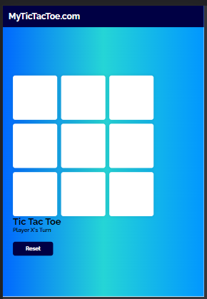

# TicTacToe   

This is a simple render of the classic `TicTacToe` we all love and play. The project is made using HTML, CSS, and Javascript, and is interactive and responsive and can run on any browser that supports HTML5. (The responsiveness might not be very great though but still it works).

The rules are standard, nothing new there. 

The website link can be found [here](https://alimuhammadasad.github.io/TicTacToe-HTML-CSS-JS/)

## Screens

**Desktop**

**Tablet:** 
 

**Mobile:**

**Winning Screen:**

The same winning screen applies for tablets and mobile phones, just the positioning changes accordingly (the winning screen is a gif).

There is not functionality yet for implementing a line through the grids, so if anyone has any ideas etc then please feel free to suggest. If anyone wants to see the code then feel free to do so.

### Thank you!